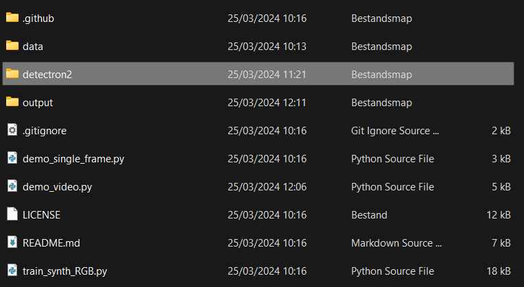
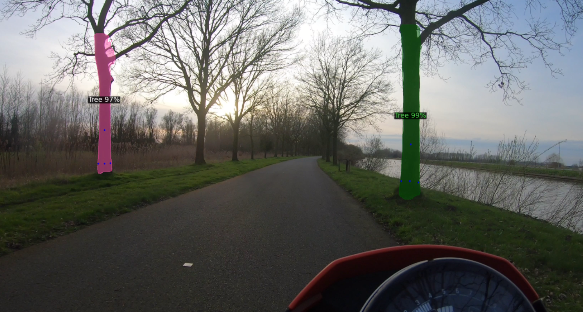

> ❗ This tutorial is only tested for Windows 11 and needs an NVIDIA GPU.
> ❗ It's advisable to perform a fresh installation rather than relying solely on existing files on GitHub. This ensures alignment with the repository.

# Tree detection

## Install CUDA

First, we need to have the right CUDA version installed. The CUDA version should be 12.1 or higher! You can check which CUDA version your GPU allows by running the following command:

```nvidia-smi```

This will display the CUDA version your GPU supports on the top right. <br>
After that you can head to the [NVIDIA website](https://developer.nvidia.com/cuda-toolkit-archive) and download the correct version of CUDA for your system. The best option is to download the .exe and let it install the CUDA toolkit for you, even if you have a older version installed, it will override it.

## Clone PercepTreeV1

After installing CUDA, you can clone the PercepTreeV1 repository (to where you want) by running the following command:

```git clone https://github.com/norlab-ulaval/PercepTreeV1.git```

## Set up the environment

After that, you need to set up the environment. You can do this by following these steps:

1. Create the environment <br>
``conda create --name tree python=3.11.7``

2. Activate the environment <br>
``conda activate tree``

3. Install CUDA <br>
``conda install cuda=12.X -c nvidia`` <br>
❗ Fill in the correct version of CUDA you installed.

4. Install PyTorch <br>
``pip3 install torch torchvision torchaudio --index-url https://download.pytorch.org/whl/cu121``

5. Install the other dependencies <br>
``pip install cython``<br>
``conda install conda-forge::pycocotools``<br>
``pip install opencv-python``

6. Clone the Detectron2 repository <br>
``git clone https://github.com/facebookresearch/detectron2.git`` <br>
❗ Clone this repository in the PercepTreeV1 folder. 


7. Install the Detectron2 repository <br>
``python -m pip install -e detectron2`` <br>
❗ If Detectron2 fails during it's setup.py develop phase, use this fix: <br>
<tab>1. Navigate to the  ``detectron2\layers\csrc\nms_rotated\nms_rotated_cuda.cu`` file <br>
<tab>2. Replace the top line with this:
```cpp
// Copyright (c) Facebook, Inc. and its affiliates. All Rights Reserved
#include <ATen/ATen.h>
#include <ATen/cuda/CUDAContext.h>
#include <c10/cuda/CUDAGuard.h>
#include <ATen/cuda/CUDAApplyUtils.cuh>
//NOTE: replace relative import
/*#ifdef WITH_CUDA
#include "../box_iou_rotated/box_iou_rotated_utils.h"
#endif
// TODO avoid this when pytorch supports "same directory" hipification
#ifdef WITH_HIP
#include "box_iou_rotated/box_iou_rotated_utils.h"
#endif*/
#include "box_iou_rotated/box_iou_rotated_utils.h"
```

## Download the model

Download the [X-101-FPN](https://drive.google.com/file/d/108tORWyD2BFFfO5kYim9jP0wIVNcw0OJ/view) model from here and place it in the ``output`` folder of the PercepTreeV1 repository.

## Bugfixing

1. To solve some bugs with the directories and the resolution please download the ``demo_video.py`` from our discord and replace it with the current one.

2. Run this command:<br>
```set OPENCV_FFMPEG_READ_ATTEMPTS=32768``` <br>
to fix an issue with the audio channel of the video.

## Run the code

Place the file you want to detect trees on in the ``output`` folder of the PercepTreeV1 repository and name it ``video.mp4``. <br>

After all these steps, you can run the code by running the following command:

```python demo_video.py```



A window should pop up with the video and the trees detected in it. <br>
